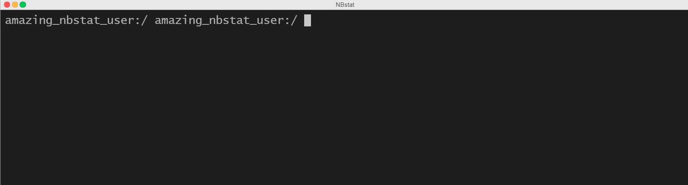

# NBTools

Collections of tools for monitoring running Jupyter Notebooks and interacting with them.

## NBstat

The main tool of this package is `nbstat` command line utility. It is added at installation (along with `devicestat`, `nbwatch` and `devicewatch` commands) and shows the detailed resource utilization for each process of each running Jupyter Notebook.

[Full user documentation: explanation of different table views, command line options and ready-to-use snippets.](nbtools/nbstat/README.md)

  
devicestat

devicestat gif

If you are interested to contribute or build related project, check out the [developer/contributor page.](nbtools/nbstat/DEV.md) It contains detailed description about inner workings of the library, my design choices and motivation behind them, as well as discussion of complexities along the way.

## Goals

## Acknowledgements
gpustat

